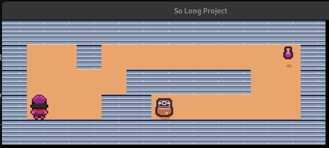

# so_long3

A optimiser:
- les fonctions de deplacement du joueur: ft_move_1, ft_move_2, ft_move_3
    (on recalcule a chaque fois le nouvelle emplacement du joueur, ce qui est inutile)
- Utiliser put_image au lieu de ("put_mlx_img") je crois. on gagneras quelques lignes
